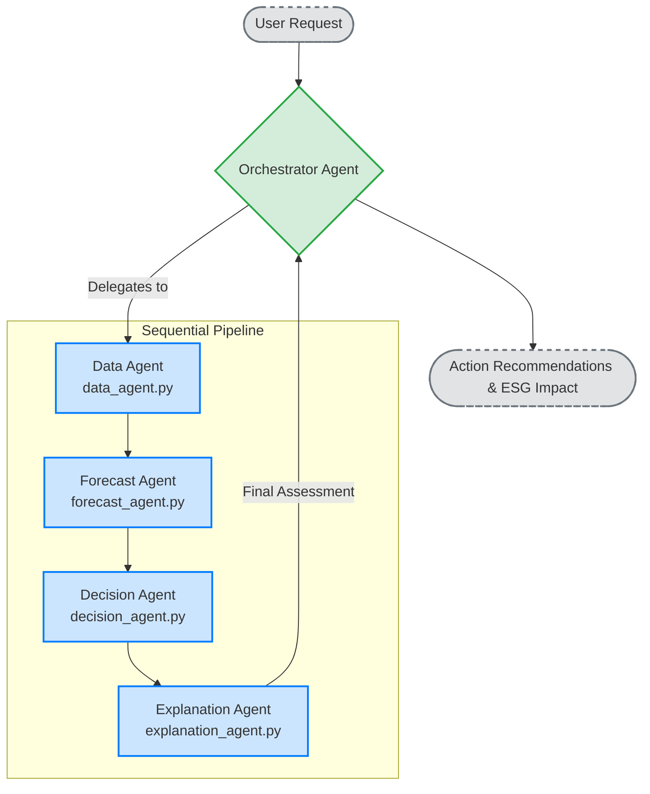

# AI-Powered Dynamic Waste Reduction Engine 🌿

An autonomous perishable waste reduction engine for supermarkets. Powered by Google ADK (Agent Development Kit) and Gemini, this project orchestrates specialized AI agents to analyze at-risk inventory, forecast spoilage, optimize decisions, and provide actionable, natural language explanations.

## 🚀 Architecture Overview

This project implements a multi-agent architecture via `Google ADK`. A main Orchestrator Agent manages a sequential pipeline of 4 specialized sub-agents:



1. **Data Agent (`agents/data_agent.py`)** 📥
   Retrieves and filters at-risk inventory batches based on projected waste and expiry dates.
2. **Forecast Agent (`agents/forecast_agent.py`)** 📈
   Utilizes Gemini to provide a confirmed spoilage risk assessment by evaluating factors like weather, sell-through rates, and current inventory.
3. **Decision Agent (`agents/decision_agent.py`)** 🧠
   Simulates potential mitigation actions (e.g., varying discounts, inter-store transfers) and calculates the optimal decision to minimize waste while protecting margin.
4. **Explanation Agent (`agents/explanation_agent.py`)** 💬
   Translates the complex, optimized decision back into plain English, explaining why a specific action was chosen over alternatives using Gemini.

### System Components

- **`orchestrator.py`**: The entry point for the ADK runtime. Wires the 4 agents into a `SequentialAgent` pipeline.
- **`app.py`**: A Gradio-powered Web UI offering:
  - **Inventory Explorer**: Tabular view of at-risk batches.
  - **Risk Heatmap**: Visual charts showing average waste risk scores.
  - **Agent Decisions**: The pipeline's recommended actions and total ESG impact.
  - **Gemini Chat**: Interactive Q&A for explaining decisions.
- **`tools.py`**: Native Python utility functions (isolated from ADK imports) for loading data, scoring risk, and wrapping business logic simulations.
- **`data/`**: Directory containing the inventory, stores, sales history, and SKU datasets.

## 💻 Running Locally

1. **Setup Environment**:
   Ensure you have Python installed, then install the dependencies:
   ```bash
   pip install -r requirements.txt
   ```

2. **Run the Gradio UI**:
   ```bash
   python app.py
   ```
   *The application will start locally (default port `7860`).*

3. **Run the Orchestrator Demo (CLI)**:
   ```bash
   python orchestrator.py
   ```
   *Runs a local test simulating a request for a specific store and SKU.*

## 🐳 Docker Build

To run the project in an isolated container:

1. **Build the Image:**
   ```bash
   docker build -t dynamic-waste-reduction-agent .
   ```
2. **Run the Container:**
   ```bash
   docker run -p 7860:7860 dynamic-waste-reduction-agent
   ```

## ☁️ Deployment

Deploy the frontend UI easily to Google Cloud Run:
```bash
gcloud run deploy waste-engine-ui --source . --port 7860
```

Deploy the backend engine using the ADK CLI:
```bash
adk deploy orchestrator.py --project YOUR_PROJECT_ID --region us-central1
```

## 🌍 ESG Impact

The platform prioritizes reducing preventable food waste, converting saved inventory back into revenue while proactively reducing CO₂e emissions. The UI dynamically summarizes value saved and emissions prevented.

## 🗺️ Roadmap

- [x] Define multi-agent architecture and orchestrator.
- [x] Set up Gradio application (`app.py`).
- [ ] Build the project via Docker.
- [ ] Deploy the project (e.g., using Google Cloud).
